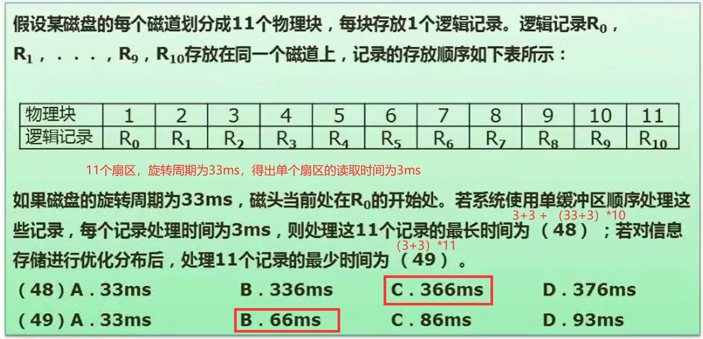

# 软件设计师

【目前已完成计组部分的笔记】

自用，适合有基础的朋友巩固

## 考试形式

计算机与软件工程知识：150 分钟，选择题

软件设计：150 分钟，问答题

1.数据流图

2.数据库

3.UML

4.算法

5.C++/JAVA 面向对象编程，二选一，以设计模式为背景考察

每一个分块掌握如何，要注重自己的缺陷部分

## 计算机组成原理与体系结构

占上午考试的 6 分，比例多

### 数据的表示

1. 进制转换(小数点后是依次是-1、-2)

二进制转八进制（三位分段）与十六进制（四位分段）

2. 编码问题：原码、反码、补码、移码

一般会告诉你多个字节来存储，比如 1 个字节，就是 8 位

原码：转为二进制，不足的前面补 0，最高位是符号位，0 为正数，1 为负数（不能直接在机器里做相关的运算）

反码：正数的反码与原码一致，负数的反码，符号位不变，其他全部取反

补码：正数的补码与原码一致，负数的补码，在反码的基础上+1

移码：补码的符号位取反

【数值表示范围。n 是 bit 数】

3. 浮点数运算

对阶 -> 尾数计算 -> 结果格式化

对阶：让两个浮点数的指数相同，一般采用大的指数

结果格式化：小数点前的数字调整为 1~9，根据调整结果修改指数

### 计算机结构

运算器和控制器的构成，经常考到

程序计数器，指向下一条指令所在位置

### Flynn 分类法

按指令流、数据流两个维度方向划分

### CISC 与 RISC

考察方式，给出 abcd 四个描述，问哪些说法是对的/错的

### 流水线技术

主要考计算问题

流水线，利用空隙时间

图中 Δt 是周期时间：

### 存储系统

#### Cache

#### 局部性原理

时间局部性：循环内的语句被多次调用

空间局部性：数组连续存储

#### 主存

1. 分类

   我们的内存就是 RAM，断电后会清除数据。而 ROM 不会清除

   

2. 编址

   答案：B、A

   C7FFFH - AC000H + 1

   112 _ 16 = 28 _ 16 \* 4

#### 磁盘

1. 磁盘结构与参数

   

2. 试题

   

### 总线系统

根据总线所处的位置不同，总线通常被分为三种类型，分别是：

1. 内部总线：微机内部各个外围的芯片与处理器之间的总线，芯片这个级别的
2. 系统总线：微机中各个插件板和系统板之间的总线，插件板这个级别
   - 数据总线：传输数据
   - 地址总线：
   - 控制总线：发送相应控制信号的总线
3. 外部总线：微机和外部设备的总线

### 可靠性

R 表示可靠度、λ 或 µ 表示失效率

串联计算公式（失效率是近似的，可能不那么准确）

并联计算公式（并联的失效率过于复杂，一般不用公式，直接 1-R 得出

模冗余系统，若 R1、R2 输出为 1，Rm 输出为 0。表决器通过输出的值进行表决，少数服从多数，最后输出。该系统的 R 一般不考察

混合系统

### 校验码

码距：任意两个码字的最小距离（变换多少个位上的数，可以变成另一个编码）

#### CRC 循环校验码

可以检错、不能纠错。

使用模 2 除法进行校验。看最高位决定上商是多少。之后做异或运算

例：
10111 对 110 进行模 2 除法

求 CRC 编码，示例

根据生成多项式中 x 的多少次方看出，对应 2 进制是 0 还是 1。在原始报文后面补上 0，个数是生成多项式长度-1 个 0（其实就是补余数的位数），得到的 4 个余数，替换刚才补的 0，就得到 CRC 编码

#### 海明码

校验位位数 r 和信息位位数 x 的关系：2^r >= x + r + 1

海明码，2 的 n 次方位置处是校验位

